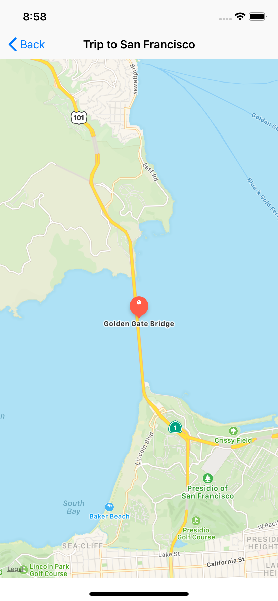

# Trip-Planner

## Description
An iOS app that allows users to plan trips. Users can create trips and trips are defined by a name. Trips can also contain a collection of waypoints. Waypoints are represented by a geographic coordinate and a name. Users are able to create, delete and modify trips.

## Data Model

- **Trips** have a name and a collection of waypoints.
- **Waypoints** have a name (the name returned from the Google Places API) and geographic coordinates.

### Main Screen 

- List of Trips
- This screen supports deleting trips by using the iOS swipe-to-delete feature.

<kbd>
 </img>
</kbd>

### Add Trip Screen

<kbd>
 </img>
</kbd>

### Trip Detail Screen

- If the trip has waypoints, the Trip Detail Screen shows the waypoints for a selected Trip within a _Table View_.
- If the trip doesn't have any waypoints yet, the screen shows another view which has a button to add waypoints
- This screen supports deleting waypoints by using the iOS swipe-to-delete feature.

<kbd>
 </img>
</kbd>

<kbd>
 </img>
</kbd>

### Add Waypoint Screen

- This screen allows the user to search for waypoints.
- It displays the search results in a _Table View_.
- The user can select an entry. The selected entry will be highlighted on the map.
- By using the *save* button, it should update the waypoints for the trip.

<kbd>
 </img>
</kbd>

<kbd>
 </img>
</kbd>

<kbd>
 </img>
</kbd>

### Waypoint Detail Screen
- Shows after clicking on a specific waypoint

<kbd>
 </img>
</kbd>

<kbd>
 </img>
</kbd>
